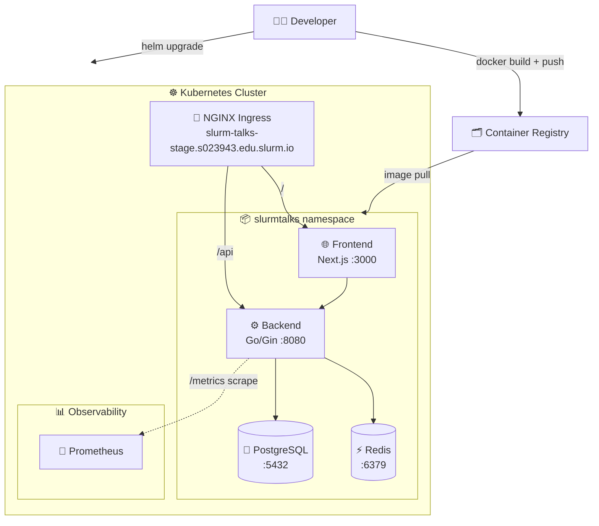

# chatapp-infrastructure

> IaC repository for deploying **SlurmTalks** (a Twitter-like social platform) to a Kubernetes cluster.
> Covers application containerisation, Kubernetes orchestration via Helm, and Prometheus metrics scraping.

## Tech Stack

### IaC & Deployment Tools

| Tool | Role |
|------|------|
| Docker | Application containerisation (multi-stage Alpine builds) |
| Helm | Kubernetes package management and release templating |
| Kubernetes | Container orchestration |

### Application Components

| Component | Technology | Port |
|-----------|-----------|------|
| Frontend | Next.js 15 / React 19 / TypeScript / Tailwind CSS (Node 20) | 3000 |
| Backend | Go 1.24 / Gin | 8080 |
| Database | PostgreSQL | 5432 |
| Cache | Redis | 6379 |

### Observability

| Component | Technology |
|-----------|-----------|
| Metrics | Prometheus (scraped from backend `/metrics`) |

## Prerequisites

- [Docker](https://docs.docker.com/engine/install/)
- [kubectl](https://kubernetes.io/docs/tasks/tools/) configured for the target cluster
- [Helm](https://helm.sh/docs/intro/install/) ≥ 3.x
- Running PostgreSQL and Redis instances accessible from the cluster

## Configuration

```bash
# Override Helm values for your environment
cp helm/slurmtalks/values.yaml helm/slurmtalks/values.local.yaml
# Edit: image tags, ingress hostname, DB/Redis connection details
```

### Key Variables

| Variable | Source | Description | Example |
|----------|--------|-------------|---------|
| `POSTGRES_HOST` | ConfigMap | PostgreSQL host | `postgres.slurmtalks.svc.cluster.local` |
| `POSTGRES_PORT` | ConfigMap | PostgreSQL port | `5432` |
| `POSTGRES_DB` | Secret | Database name | `slurmtalks` |
| `POSTGRES_USER` | Secret | Database user | `app` |
| `POSTGRES_PASSWORD` | Secret | Database password | `s3cr3t` |
| `REDIS_ADDR` | ConfigMap | Redis address with port | `redis-master:6379` |
| `REDIS_PASSWORD` | Secret | Redis password | `r3dis` |
| `JWT_SECRET_KEY` | Secret | JWT signing secret | `changeme` |
| `NEXT_PUBLIC_BACKEND_URL` | ConfigMap | Backend API URL seen by frontend | `https://host/api` |
| `MIGRATE_IN_CODE` | ConfigMap | Run DB migrations on startup | `true` |
| `SIMULATED_METRICS` | ConfigMap | Enable fake metric generation | `false` |


## Project Structure

```
chatapp-infrastructure/
├── backend-service/   # Go API — auth, tweets, users; Dockerfile; SQL migrations
├── frontend-service/  # Next.js UI; Dockerfile
├── helm/              # Helm umbrella chart (slurmtalks) with backend & frontend sub-charts
├── longhorn/          # Longhorn persistent storage configuration
└── README.md
```

## Architecture



## Ingress Routing

| Path | Service | Port |
|------|---------|------|
| `/` | frontend | 80 |
| `/api` | backend | 8080 |

Default hostname: `slurm-talks-stage.s023943.edu.slurm.io`

## Resource Limits

| Component | CPU Request | CPU Limit | Memory Request | Memory Limit | HPA |
|-----------|-------------|-----------|----------------|--------------|-----|
| Backend | 250m | 500m | 256Mi | 512Mi | 1–3 replicas (CPU 10%) |
| Frontend | 100m | 250m | 128Mi | 256Mi | — |
